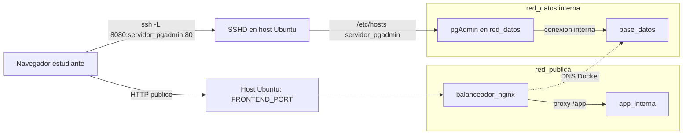

# Practica 11 - Reporte Base

Este archivo sirve como base del reporte. Agregar aqui las capturas tomadas en la VM y en el cliente cuando se realicen las pruebas.

## Archivo De Orquestacion

El archivo operativo esta en `docker-compose.yml`.

```yaml
version: "2.4"

services:
  balanceador_nginx:
    build:
      context: ./nginx
    container_name: servidor_nginx
    ports:
      - "${FRONTEND_PORT}:8080"
    depends_on:
      app_interna:
        condition: service_started
      base_datos:
        condition: service_healthy
    networks:
      - red_publica
      - red_datos
    restart: always
    mem_limit: 256m
    cpus: 0.50

  app_interna:
    build:
      context: ./app
    container_name: servidor_app
    environment:
      APP_MESSAGE: ${APP_MESSAGE}
    expose:
      - "8080"
    networks:
      - red_publica
    restart: always
    mem_limit: 256m
    cpus: 0.50

  base_datos:
    image: postgres:16-alpine
    container_name: servidor_postgres
    environment:
      POSTGRES_DB: ${POSTGRES_DB}
      POSTGRES_USER: ${POSTGRES_USER}
      POSTGRES_PASSWORD: ${POSTGRES_PASSWORD}
    volumes:
      - db_data:/var/lib/postgresql/data
      - ./postgres/init.sql:/docker-entrypoint-initdb.d/init.sql:ro
    expose:
      - "5432"
    networks:
      - red_datos
    healthcheck:
      test: ["CMD-SHELL", "pg_isready -U $$POSTGRES_USER -d $$POSTGRES_DB"]
      interval: 10s
      timeout: 5s
      retries: 6
      start_period: 15s
    restart: always
    mem_limit: 512m
    cpus: 0.75

  servidor_pgadmin:
    image: dpage/pgadmin4:8
    container_name: servidor_pgadmin
    environment:
      PGADMIN_DEFAULT_EMAIL: ${PGADMIN_DEFAULT_EMAIL}
      PGADMIN_DEFAULT_PASSWORD: ${PGADMIN_DEFAULT_PASSWORD}
    depends_on:
      base_datos:
        condition: service_healthy
    expose:
      - "80"
    networks:
      - red_datos
    restart: always
    mem_limit: 384m
    cpus: 0.50

volumes:
  db_data:

networks:
  red_publica:
    driver: bridge
  red_datos:
    driver: bridge
    internal: true
```

## Ejemplo De `.env`

```dotenv
COMPOSE_PROJECT_NAME=sysadmin11
FRONTEND_PORT=80
SSH_PORT=22
POSTGRES_DB=infra_app
POSTGRES_USER=infra_admin
POSTGRES_PASSWORD=Practica11_DB_ChangeMe
PGADMIN_DEFAULT_EMAIL=admin@sysadmin.com
PGADMIN_DEFAULT_PASSWORD=Practica11_PGAdmin_ChangeMe
APP_MESSAGE=Aplicacion interna protegida por balanceador Nginx
```

## Diagrama De Flujo De Datos



## Bitacora De Pruebas

| Prueba | Comando / Accion | Resultado Esperado | Evidencia |
| --- | --- | --- | --- |
| 11.1 Aislamiento | `curl http://IP_SERVIDOR:5432` y `curl http://IP_SERVIDOR:5050` desde cliente externo | Rechazo o timeout | Pendiente captura |
| 11.2 DNS interno | `sudo docker exec servidor_nginx ping -c 3 base_datos` | Respuesta por nombre de servicio | Pendiente captura |
| 11.3 Tunel SSH | `ssh -L 8080:servidor_pgadmin:80 usuario@IP_SERVIDOR` y abrir `localhost:8080` | pgAdmin carga por tunel | Pendiente captura |
| 11.4 Persistencia | `docker compose down` y `docker compose up -d` tras insertar datos | Datos intactos; pgAdmin espera BD healthy | Pendiente captura |
