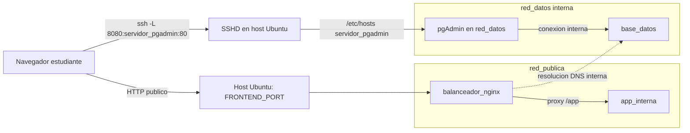

# Practica 11 - Guia De Validacion

Despliegue en Ubuntu Server:

```bash
cd Practica_11
sudo bash main.sh
```

El script crea `.env` desde `.env.example` si no existe. Las credenciales y puertos se gestionan desde `.env`, no desde `docker-compose.yml`.

## Servicios

| Servicio | Contenedor | Expuesto Al Host | Redes | Persistencia |
| --- | --- | --- | --- | --- |
| Balanceador Nginx | `servidor_nginx` | `${FRONTEND_PORT}:8080` | `red_publica`, `red_datos` | No aplica |
| App interna | `servidor_app` | No | `red_publica` | No aplica |
| PostgreSQL | `servidor_postgres` | No | `red_datos` | Volumen `db_data` |
| pgAdmin | `servidor_pgadmin` | No | `red_datos` | No aplica |

## Archivo `.env` De Ejemplo

```dotenv
COMPOSE_PROJECT_NAME=sysadmin11
FRONTEND_PORT=80
SSH_PORT=22
POSTGRES_DB=infra_app
POSTGRES_USER=infra_admin
POSTGRES_PASSWORD=Practica11_DB_ChangeMe
PGADMIN_DEFAULT_EMAIL=admin@sysadmin.local
PGADMIN_DEFAULT_PASSWORD=Practica11_PGAdmin_ChangeMe
APP_MESSAGE=Aplicacion interna protegida por balanceador Nginx
```

## Diagrama De Flujo De Datos



## Prueba 11.1 - Aislamiento De Red

Desde la maquina fisica o cliente del estudiante:

```bash
curl http://IP_SERVIDOR:5432
curl http://IP_SERVIDOR:5050
```

Resultado esperado: conexion rechazada o timeout. PostgreSQL y pgAdmin no tienen puertos publicados al host.

## Prueba 11.2 - Resolucion DNS Interna

En el servidor:

```bash
sudo docker exec servidor_nginx ping -c 3 base_datos
```

Resultado esperado: el ping responde usando el nombre del servicio, no una IP fija.

## Prueba 11.3 - Tunel Cifrado De Gestion

Desde la computadora/cliente del estudiante:

```bash
ssh -L 8080:servidor_pgadmin:80 usuario@IP_SERVIDOR
```

Abrir en navegador local:

```text
http://localhost:8080
```

Resultado esperado: carga pgAdmin por el tunel SSH. Credenciales por defecto si no se modifico `.env`:

```text
admin@sysadmin.local
Practica11_PGAdmin_ChangeMe
```

Dentro de pgAdmin, registrar el servidor PostgreSQL con estos datos si se usan los valores de prueba:

```text
Host: base_datos
Port: 5432
Maintenance database: infra_app
Username: infra_admin
Password: Practica11_DB_ChangeMe
```

Si cambio `.env`, usar los valores configurados ahi.

## Prueba 11.4 - Persistencia Y Buen Funcionamiento

Crear datos de prueba:

```bash
sudo docker exec servidor_postgres psql -U infra_admin -d infra_app -c "INSERT INTO usuarios_app(usuario) VALUES ('persistencia_11') ON CONFLICT DO NOTHING;"
sudo docker exec servidor_postgres psql -U infra_admin -d infra_app -c "SELECT * FROM usuarios_app;"
```

Detener y recrear contenedores sin borrar volumen:

```bash
cd Practica_11
sudo docker compose down
sudo docker compose up -d
sudo docker exec servidor_postgres psql -U infra_admin -d infra_app -c "SELECT * FROM usuarios_app;"
```

Resultado esperado: los datos permanecen porque `db_data` no se borra. pgAdmin debe esperar a que PostgreSQL este `healthy` gracias a `depends_on` y `healthcheck`.

## Evidencias Para Reporte

- Captura de `docker compose ps` mostrando servicios activos.
- Captura de prueba 11.1 desde cliente externo.
- Captura de prueba 11.2 con ping interno desde Nginx.
- Captura de prueba 11.3 con pgAdmin cargando por `localhost:8080`.
- Captura de prueba 11.4 mostrando datos persistentes despues de `down` y `up`.
