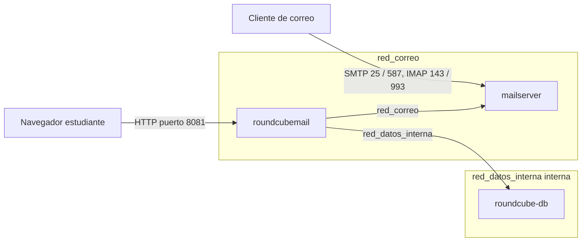

# Practica 12 - Reporte Base

Este archivo sirve como base del reporte. Agregar aqui las capturas tomadas en la VM y en el cliente cuando se realicen las pruebas.

## Archivo De Orquestacion

El archivo operativo esta en `docker-compose.yml`.

```yaml
services:
  mailserver:
    image: ghcr.io/docker-mailserver/docker-mailserver:latest
    container_name: mailserver
    hostname: ${HOSTNAME}
    domainname: ${DOMAIN}
    ports:
      - "25:25"    # SMTP
      - "143:143"  # IMAP
      - "587:587"  # SMTP seguro / submission
      - "993:993"  # IMAP seguro
    volumes:
      - mail_data:/var/mail
      - mail_state:/var/mail-state
      - ./logs:/var/log/mail
      - ./config:/tmp/docker-mailserver
      - /etc/localtime:/etc/localtime:ro
    environment:
      - ENABLE_SPAMASSASSIN=1
      - ENABLE_FAIL2BAN=1
      - ENABLE_POSTGREY=0
      - ENABLE_SASLAUTHD=0
      - ONE_DIR=1
      - TLS_LEVEL=intermediate
      - PERMIT_DOCKER=connected-networks
    cap_add:
      - NET_ADMIN
    restart: always
    networks:
      - red_correo

  roundcube-db:
    image: mariadb:10.5
    container_name: roundcube-db
    restart: always
    volumes:
      - roundcube_db_data:/var/lib/mysql
    environment:
      - MYSQL_ROOT_PASSWORD=${DB_ROOT_PASSWORD}
      - MYSQL_DATABASE=roundcubemail
      - MYSQL_USER=${DB_USER}
      - MYSQL_PASSWORD=${DB_PASSWORD}
    networks:
      - red_datos_interna
    healthcheck:
      test: ["CMD-SHELL", "mysqladmin ping -h localhost -u root --password=$$MYSQL_ROOT_PASSWORD || exit 1"]
      interval: 10s
      timeout: 5s
      retries: 5

  roundcubemail:
    image: roundcube/roundcubemail:latest
    container_name: roundcubemail
    restart: always
    depends_on:
      roundcube-db:
        condition: service_healthy
    ports:
      - "8081:80"
    environment:
      - ROUNDCUBEMAIL_DB_TYPE=mysql
      - ROUNDCUBEMAIL_DB_HOST=roundcube-db
      - ROUNDCUBEMAIL_DB_NAME=roundcubemail
      - ROUNDCUBEMAIL_DB_USER=${DB_USER}
      - ROUNDCUBEMAIL_DB_PASSWORD=${DB_PASSWORD}
      - ROUNDCUBEMAIL_DEFAULT_HOST=mailserver
      - ROUNDCUBEMAIL_DEFAULT_PORT=143
      - ROUNDCUBEMAIL_SMTP_SERVER=mailserver
      - ROUNDCUBEMAIL_SMTP_PORT=587
    networks:
      - red_correo
      - red_datos_interna

networks:
  red_correo:
    driver: bridge
  red_datos_interna:
    driver: bridge
    internal: true

volumes:
  roundcube_db_data:
  mail_data:
  mail_state:
```

## Ejemplo De `.env`

```dotenv
COMPOSE_PROJECT_NAME=sysadmin12

DOMAIN=reprobados.com
HOSTNAME=mail

DB_ROOT_PASSWORD=Practica12_Root_ChangeMe
DB_USER=roundcube_user
DB_PASSWORD=Practica12_DB_ChangeMe
```

## Diagrama De Flujo De Datos



## Bitacora De Pruebas

| Prueba | Comando / Accion | Resultado Esperado | Evidencia |
| --- | --- | --- | --- |
| 12.1 Stack activo | `docker compose ps` | `mailserver` y `roundcubemail` Up, `roundcube-db` healthy | Pendiente captura |
| 12.2 Puertos | `nc -zv IP_SERVIDOR 25/143/587/993` y `curl http://IP_SERVIDOR:8081` | SMTP/IMAP responden; webmail HTTP 200/301/302 | Pendiente captura |
| 12.3 Cuentas | `docker exec mailserver setup email list` | Las cinco cuentas del dominio listadas | Pendiente captura |
| 12.4 Envio/recepcion | Webmail Roundcube y `sendmail -v vegeta@reprobados.com` | Correo entregado; `status=sent` en `logs/mail.log` | Pendiente captura |
| 12.5 DKIM | `opendkim-testkey -d reprobados.com -s mail -vvv` | Clave local configurada (sin DNS externo puede no ser secure) | Pendiente captura |