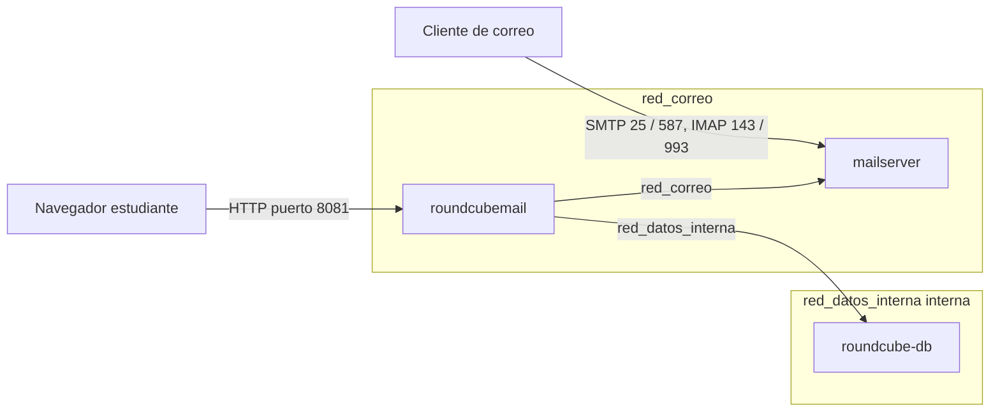

# Practica 12 - Guia De Validacion

Despliegue en Ubuntu Server:

```bash
cd Practica_12
sudo bash main.sh
```

El script instala Docker/Docker Compose si faltan, crea `.env` desde `.env.example` si no existe, configura el firewall (SSH, SMTP/IMAP y webmail) y levanta el stack de correo.

## Servicios

| Servicio | Contenedor | Puertos Al Host | Redes | Persistencia | Config |
| --- | --- | --- | --- | --- | --- |
| Servidor de correo | `mailserver` | `25` (SMTP), `143` (IMAP), `587` (SMTP seguro), `993` (IMAPS) | `red_correo` | Volumenes `mail_data`, `mail_state` | `./config` en `/tmp/docker-mailserver`; logs en `./logs` |
| Base de datos webmail | `roundcube-db` | No | `red_datos_interna` | Volumen `roundcube_db_data` | Credenciales desde `.env` |
| Webmail | `roundcubemail` | `8081` (HTTP) | `red_correo`, `red_datos_interna` | No aplica | Configurado via variables de entorno |

## Credenciales De Las Cuentas De Correo

El stack viene precargado con cuentas del dominio configurado en `.env` (por defecto `reprobados.com`). Todas usan la misma contrasena:

```text
Contrasena: PasswordSegura123!
```

Cuentas:

- `director@reprobados.com`
- `admin@reprobados.com`
- `kami@reprobados.com`
- `goku@reprobados.com`
- `vegeta@reprobados.com`

Para anadir una cuenta nueva:

```bash
docker exec -it mailserver setup email add usuario@reprobados.com 'ContrasenaNueva'
```

## Archivo `.env` De Ejemplo

```dotenv
COMPOSE_PROJECT_NAME=sysadmin12

DOMAIN=reprobados.com
HOSTNAME=mail

DB_ROOT_PASSWORD=Practica12_Root_ChangeMe
DB_USER=roundcube_user
DB_PASSWORD=Practica12_DB_ChangeMe
```

## Diagrama De Flujo De Datos



## Prueba 12.1 - Stack De Correo Activo

En el servidor:

```bash
cd Practica_12
sudo docker compose ps
```

Resultado esperado: `mailserver` y `roundcubemail` en estado `Up` y `roundcube-db` en `Up (healthy)`.

## Prueba 12.2 - Puertos De Correo Y Webmail

Verificar que los puertos responden desde el propio servidor o desde la maquina cliente:

```bash
nc -zv IP_DEL_SERVIDOR 25
nc -zv IP_DEL_SERVIDOR 143
nc -zv IP_DEL_SERVIDOR 587
nc -zv IP_DEL_SERVIDOR 993
curl -s -o /dev/null -w '%{http_code}\n' http://IP_DEL_SERVIDOR:8081
```

Resultado esperado: SMTP/IMAP aceptan conexion y Roundcube responde con HTTP 200/301/302.

## Prueba 12.3 - Cuentas De Correo

```bash
docker exec -it mailserver setup email list
```

Resultado esperado: aparecen las cinco cuentas del dominio.

## Prueba 12.4 - Envio Y Recepcion

### Desde el webmail

1. Abrir `http://IP_DEL_SERVIDOR:8081`.
2. Iniciar sesion con `goku@reprobados.com` y contrasena `PasswordSegura123!`.
3. Redactar un correo hacia `vegeta@reprobados.com` y enviarlo.
4. Cerrar sesion, entrar como `vegeta@reprobados.com` y confirmar que el correo llego a la bandeja de entrada.

### Desde la terminal del servidor

```bash
docker exec -it mailserver bash -c 'echo "Subject: Prueba" | sendmail -v vegeta@reprobados.com'
```

Luego confirmar la entrega en el log:

```bash
grep 'status=sent' Practica_12/logs/mail.log | tail -n 5
```

## Prueba 12.5 - DKIM (Opcional)

```bash
docker exec -it mailserver opendkim-testkey -d reprobados.com -s mail -vvv
```

*Si no hay DNS publico para el dominio, es normal que muestre `key not secure` o `query failed`; la clave local debe coincidir.*

## Revision Automatica

En el servidor, con el stack levantado:

```bash
cd Practica_12
sudo bash revision.sh
```

El script ejecuta las pruebas 12.1 a 12.4, muestra la informacion DKIM, y escribe un log de evidencia `revision_<fecha>_<hora>.log`.

## Evidencias Para Reporte

- Captura de `docker compose ps` con los tres servicios activos.
- Captura de la prueba 12.2 (puertos con `nc` y webmail con `curl`).
- Captura de la prueba 12.3 (`setup email list`).
- Captura de la prueba 12.4: correo enviado y recibido en Roundcube, y `status=sent` en `logs/mail.log`.
- Captura de la revision automatica con el resumen PASS.